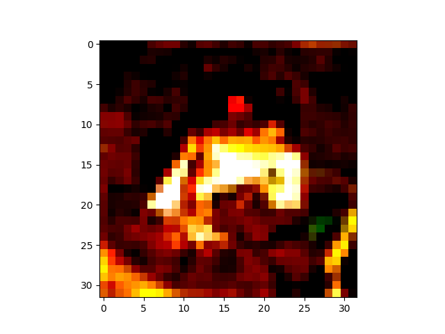
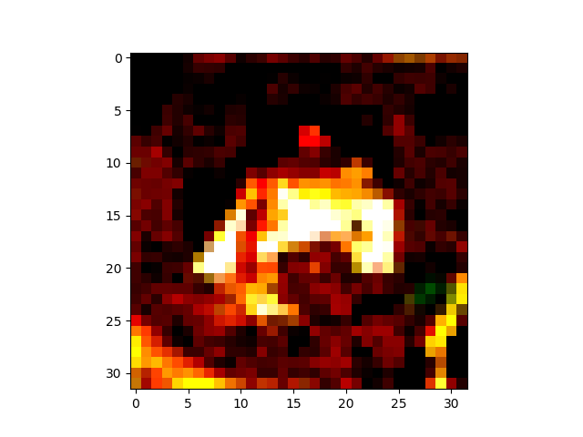

# Simple_Adversarial_Example
Adversarial example입니다. 

## Adversarial Attack이란,

적은 변화로 학습시킨 모델의 판단의 혼란을 야기한다. 

특히, 인간의 판단에는 영향을 끼치지 않을 정도로 작은 변화이나 모델의 판단에는 큰 변화를 준다.

## Dataset

- cifar10

## Model

- VGG16

## result

### original example

### adversarial example

육안으로는 두 이미지는 큰 차이는 없으나, adversarial example은 완전히 다른 판별을 한다.

위의 example은 다음과 같은 결과를 가진다.

- label : 6

- original predict : 6

- adversarial predict : 3

# reference

https://github.com/anishathalye/obfuscated-gradients

keras version에서 학습된 model을 활용할 수 있게 수정하였습니다.
